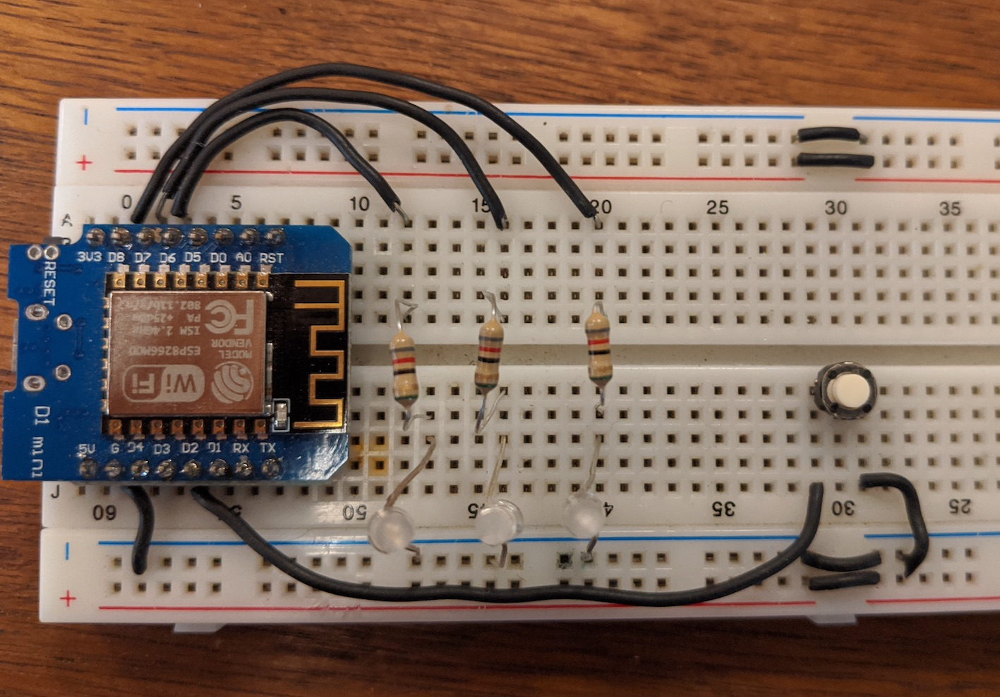
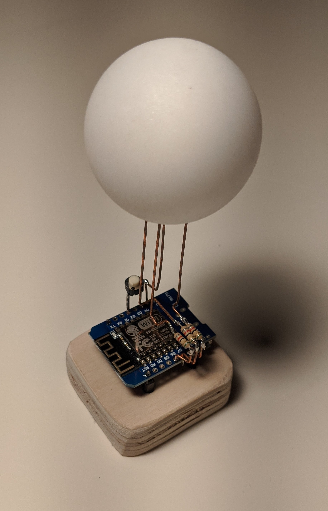

  
  
 

## What is it?

It's a physical device used to start and stop timers from clockfy. 

  
 

## Why do I need it?

I found myself using the clockfy webapp to start timers, but I kept on forgetting to stop them. I wanted to have a physical device to remid me that a timer was running, so I sarted to work on this project.

 
  
## How to build the circuit?
Components needed:
- 3x 82ohm resistors.
- Blue LED
- Red LED
- Green LED
- Pushbutton
- ESP8266 MCU
  
Connections:
- Green LED -> D8
- Red LED -> D7
- Blue LED -> D6
- Buttton -> D2

  

  

 

## How to install it?
Build it using the [PlatforIO IDE](https://platformio.org/). 

Before burning the firmware to the MCU, 2 configuration files must be created, or just rename the example files:

*lib/WifiManager/src/wifi_configuration.h* - Contains the wifi credentials.

*lib/TimerRepository/include/Clockfy/clockfy_configuration.h* - contains the Clockfy API key.

 

## How to use it?

__Short press to choose a project.__ 
The light will match the project's color.

  

 

__Long press to start a timer.__ Short blink to let the user know that the request has been sent. Breathe effect starts.

  

 

__Long press to stop timer.__ The light blinks to give feedback. Rapid green blikning if the request is successful, long red blink if there's an error.

  

 

__Always in sync.__ It is periodically checking if there's any timer running . 

 
    
    
 

 
 
 
 

_An api key might be found across commit history. It is no longer valid._

